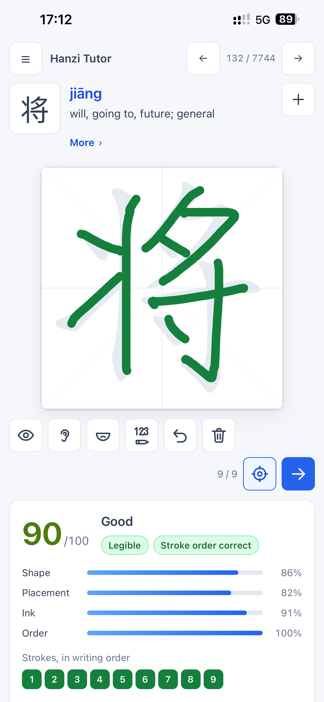
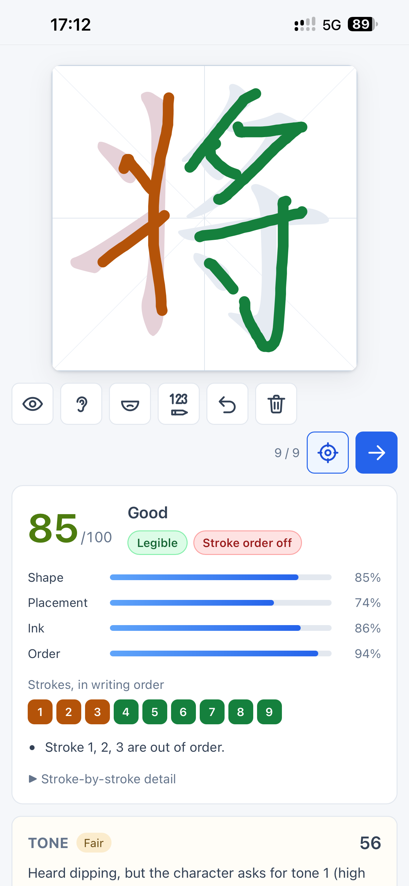
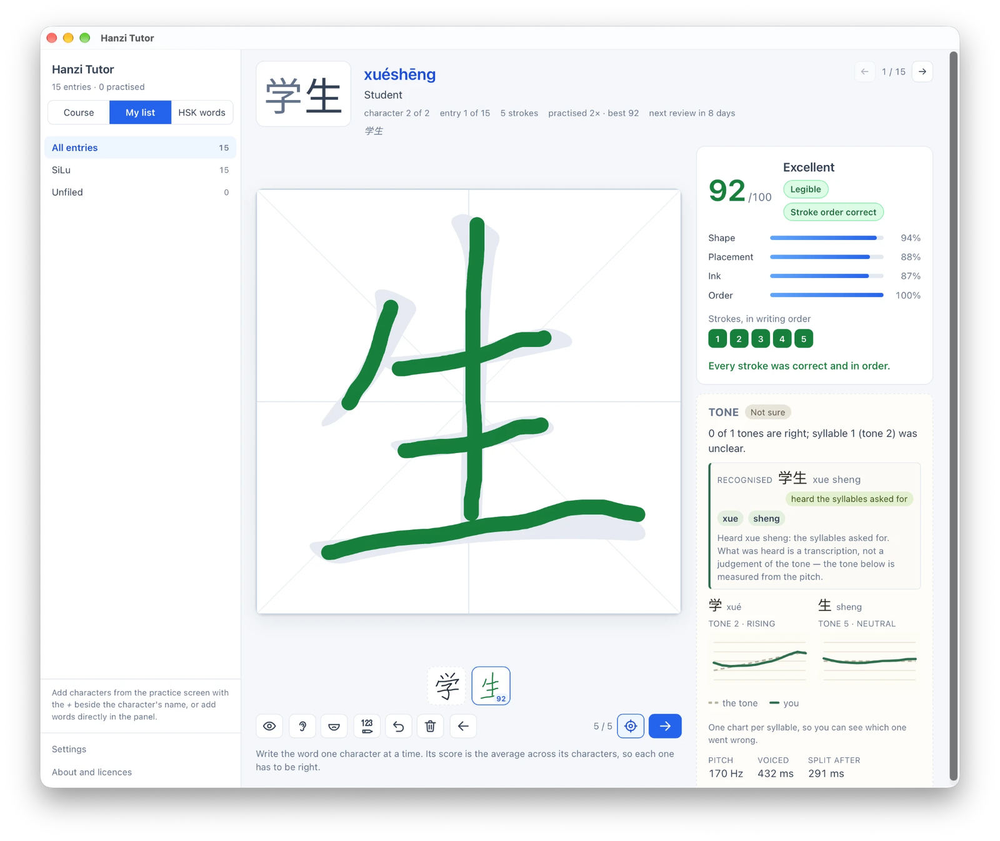

# Hanzi Tutor

An app for learning to **read and write simplified Chinese characters**. You write
a character with a mouse, trackpad, finger or stylus, and it tells you whether it
was written in the correct stroke order, whether the strokes are the right shape,
in the right place and with enough ink, and whether the result is legible. Hold a
button and **say** the character, and it tells you whether your tone was right —
by measuring the pitch of your voice, which needs no model and works with no
network at all.

There is one optional exception to that. Recognising *which* syllable you said,
rather than how you said it, needs a speech model, and a Chinese one worth using
is 163 MB. So it is **not** bundled: it is downloaded once, from the settings
screen, only if you press the button, and the screen tells you the address, the
size and the licence before you do. Everything the course teaches needs nothing.

Built with **Tauri 2 + Rust** for the engine and **Svelte 5 + TypeScript** for the
interface. The same code builds for **macOS, Windows, Linux, iOS and Android**;
it runs on the iPhone (simulator and device) and on Android (emulator and a
physical phone), with a phone layout made for practice rather than for fitting. It
speaks through each system's own synthesiser, preferring a voice that needs no
network. The Rust engine — the grading, the pitch analysis, the data — has no
platform code in it at all, which is why none of those ports needed a `cfg` in
the core. Speech recognition runs on all three of the platforms this project is
built for, phones included, and is the one part that is *not* a single binary:
each target links a native engine of its own, fetched and pinned per platform. See
[On a phone](#on-a-phone).

<p align="center">
  
  
</p>

*The same character, 将, written twice on a phone: once in the right order, and
once with its first three strokes out of order — which the grader says in as
many words, colours on the board and marks in the stroke list, while the panel
below scores the tone that was spoken with it. The artwork and screenshots for
the Play listing are in [`store/`](store/).*

## Status

Working end to end. The grading engine, the dataset pipeline, the Tauri command
layer, the drawing UI, pronunciation, the personal vocabulary list, per-character
progress with spaced repetition, the HSK 3.0 **word list**, the **raster ink
measure**, the **durable study store**, **tone practice**, **speech
recognition** and optional **cross-device sync** through your own Dropbox — for
characters *and words*, on desktop and on both mobile systems — are all implemented
and tested; **491 automated tests** pass, and 4 more are
ignored unless a microphone or the speech model is present. A
signed Android
release bundle is built and runs on a physical phone, and the recognition model
has been installed and used on both a physical iPhone and a physical Android
phone; what is left for the Play Store is publishing the privacy policy and
filling in the Console listing, not code. What is not built yet is listed under
[Next steps](#next-steps).

## What it does

- **9,574 characters** with real stroke geometry, of which **7,744** are in the
  frequency list and organised into **775 lessons** of ten.
- **9,443 HSK 3.0 words**, searchable by character, reading (with or without tone
  marks) or English meaning, and practisable straight from the list. Clicking a
  character in a word finds every word that uses it.
- **Any character looked up**, not only walked past in course order. Search by the
  character, by a reading with or without tone marks, or by an English meaning; type
  a word as characters (`医院`) or as its reading (`yisheng`) and it reaches the
  characters it is made of. Each result opens onto the character's readings, meaning,
  radical, stroke count, HSK level, frequency place, how well it is known and every
  HSK word using it, and can be written on the board from there. The list filters by
  HSK level, or to the thousands of characters the course teaches that no HSK list
  names.
- **Two practice modes.** *Trace* puts a faint copy of the character on the board
  to follow. *Recall* shows only the pinyin and meaning, and grades what you
  write from memory.
- **Keyboard shortcuts, in a card that does not cover the board.** `?` opens it —
  there is an entry at the foot of the sidebar too — and it lists Enter to check or
  move on, ⌫ or ⌘Z to take a stroke back, ← and → to move, S to watch the character
  written and H to hear it. Because it leaves the board visible and takes no keys
  away, a shortcut can be read and then tried with the card still open. Escape
  closes it.
- **Tone pairs, heard and then said.** The characters that differ only in tone —
  妈 mā, 麻 má, 马 mǎ, 骂 mà — derived from the dataset's own readings and ranked so
  the common ones come first, with a filter for the pairs worth drilling (2 against
  3, 1 against 4). *Hear* plays a set in tone order; *Quiz* says one at random and
  asks which reading it was; *Practise* sends the set to the board in tone order,
  where the microphone and the contour chart already are.
- **An introduction read once, and what changed after an update.** A first launch
  gets four short pages: what the app is, what Trace and Recall are for, the four
  measures an attempt is graded on, and where the course, the word list and the
  rest of the app live. An installation that has **run before** is shown what
  changed in the version it just updated to instead — the tutorial is not news to
  somebody who has been using the app. Each is read once and gets out of the way
  afterwards; the Settings screen can show either again, and reading one again
  changes nothing and is not remembered.
- **Two ways to draw.** Press-and-drag, which is what a stylus does, or **click to
  draw**: one click starts a stroke, moving the pointer extends it, and a second
  click ends it — no button to hold down for a long stroke on a trackpad. Escape
  or Backspace abandons an unfinished stroke. Both modes put down identical
  geometry, so the grade does not depend on which one you used. On a trackpad or
  with a mouse, click-to-draw is what you get to begin with; a touch or pen device
  still starts on dragging. It is set in *Settings* — deliberately not on the
  board — and your choice is remembered.
- **Stroke-order animation** — a pen walks each stroke's centre-line and the
  outline appears behind it, so the direction a stroke is written in is shown and
  not only the order the strokes come in. It can be stopped at any point, and
  starting to write ends it for you.
- **Grading with specific feedback**, not just a number: which stroke is the
  wrong shape, which is misplaced, which was drawn back to front, which has too
  little ink, which is missing, and which are out of order.
- **Colour-coded overlay** — your strokes are tinted by verdict, and reference
  shapes are ghosted in red where a stroke should have gone.
- **Readings and meanings** — pinyin, English gloss, radical, stroke count, HSK
  level and frequency rank, plus the etymology mnemonic where one exists.
- **Radicals, taught as families** — the parts the characters are built from,
  with what each one means and every character in the course that shares it,
  ordered by how many characters it unlocks. A character's page names its radical
  and its meaning and opens the family. The radical shown is the **Kangxi head
  form** (`言`, `人`, `水`); the shape inside the character is that same radical's
  combining form (`讠`, `亻`, `氵`), and seeing them together is the point. The
  radical itself can be written on the board, and so can the whole family.
- **What a character is built from** — every character's Make Me a Hanzi
  decomposition, read from its IDS string: 说 is 讠 + 兑, 草 is 艹 + 早, 言 is
  亠 + 二 + 口, with the arrangement named in words. Every part the board can draw
  is a button that puts it on the board on its own, which is how a character stops
  being a picture.
- **Pronunciation** — hear any character or word through the system's own speech
  synthesiser, and hear a graded phrase from the clips that ship with the app, in the
  one voice the course uses. Nothing is downloaded unless you install the optional
  speech model, and nothing leaves the machine.
- **Tone practice** — hold a button, say a character *or a whole word*, and see
  whether the tones were right. Your pitch is drawn as a curve against the shape
  each tone asks for — one chart per syllable, so a word tells you *which*
  syllable went wrong — with an honest "not sure" when there was not enough voice
  to judge. This is the one error handwriting cannot see: 妈 written perfectly and
  said as `má` is a different word.
  The **neutral tone is scored as well**, on being level — which is the part of it
  that a single syllable can show — and the panel says plainly what that judgement
  cannot see, since a neutral tone is short and takes its height from the syllable
  before it. 的 is the most common character in the language, and it would be a
  poor teacher that declined to look at it.
  Words are scored as words, which matters more than it sounds. Mandarin tone
  changes inside a word, so 你好 is spoken `níhǎo` — tone 2 then tone 3 — even
  though a dictionary lists `nǐhǎo`. Scoring you against the dictionary would mark
  correct speech wrong, so the app applies the sandhi rules and tells you when it
  has. There is **no speech model** behind any of this: tone is a pitch contour, so
  it is measured rather than recognised, which is why it works offline with
  nothing to download. You already know the character and its reading; only *how*
  it was said is in question. See
  [How tone scoring works](#how-tone-scoring-works).
- **Recognising *what* you said, optionally.** Tone scoring tells you a tone was
  wrong; it cannot tell you that you said 是 when the word was 四, because `shì`
  and `sì` can score identically on pitch. That needs a speech model, so it is the
  one feature that is not in the bundle — install it from the settings screen and
  a recording is also read as syllables, reported as plain pinyin beside the tone
  verdict: *heard `shi` where `si` was asked for*. It is honest about its limits:
  a recogniser's language model repairs a learner's mistakes toward the likely
  word, so this says which syllables were heard and never claims your
  pronunciation was good. See
  [Recognising what was said](#recognising-what-was-said).
- **Your own vocabulary list** — record the characters and words from your own
  lessons, file them under your own group names, and drill exactly those. A
  character fills in its pinyin and meaning automatically; so does a word, from
  the HSK dictionary, and a word the dictionary does not know still gets its
  reading composed from its characters. It can hold vocabulary the built-in course
  never covers. Export to JSON (lossless) or CSV for a spreadsheet.
- **Progress that persists, and a review queue.** Every graded character is
  remembered — attempts, best score, a short history and a due date — whether it
  came from the course or from a word in your list. Answer well and it comes back
  later; answer badly and it comes back within the minute. The course opens where
  you left off, each lesson shows how much of it you have practised, and
  *Review due* drills what has come back, most overdue first.
- **A study store with room to grow.** The schedule, the list and your place in
  the course live in one SQLite database, and every attempt ever made is kept in
  an unbounded log rather than a twenty-entry history — which is what the grading
  tolerances will be tuned against, once there are real attempts to look at.
- **Sentences, one character at a time.** Any multi-character text written into
  the list — a word, a phrase, a sentence — is practised character by character,
  with anything the board cannot draw (punctuation, an unknown glyph) skipped
  rather than dead-ending the attempt.
- **A box per character of a word.** Under the board, a multi-character entry
  shows one box per character: a character already written appears as a miniature
  of your own attempt with the score it got, and one still to write is an empty
  box. Click any box to put that character back on the board — a written one
  comes back with its drawing and its grade, to look at again or improve, and an
  unwritten one is ready to write. The word is recorded once every character has
  been written, not necessarily in order.
- **Settings you actually own.** A fourth screen holds the four things the app
  would otherwise decide for you: whether a stroke is committed by clicking or by
  dragging, how fast the stroke-order animation runs, how much of the window the
  board takes, and which installed voice pronounces. Each change is written as
  you make it — there is no Save button — and a change that could not be written
  says so instead of pretending. The first and the last can be left **Automatic**,
  which is what a fresh install has and what lets a trackpad get click-to-draw
  while a stylus gets dragging without anybody deciding.
- **About and licences.** The fifth screen in the sidebar names the app's own
  licence and shows the full text of the third-party licences that travel with it:
  the embedded datasets, the interface font, and the third-party code compiled or
  linked into the binary. For each it says what that source contributes and where
  the notice sits inside the bundle. The catalogue is **curated rather than
  exhaustive** — it names the sources whose licences oblige an attribution, not
  every crate and package in the build graph, which run into the hundreds and are
  almost all MIT or Apache-2.0, and whose licence texts the catalogue carries
  anyway. `LICENSES.md` draws that line in the same place. It also records the
  terms of the optional speech model, which this app points at rather than ships.
  Nothing on it is fetched, and none of the notices depend on a download: it is
  the receipt for the claims in [Data and licences](#data-and-licences).

## Quick start

Requires Rust (1.77+), Node 20+ and pnpm. On macOS you also need Xcode command
line tools.

```bash
pnpm install
pnpm run fetch-sherpa       # unpacks the pinned speech library (see below)
pnpm run dev                # launches the app
```

Everything the *course* needs is committed: the ~13 MB dataset artifact, the
interface font and every licence notice, so nothing about the app's own content is
fetched. `fetch-sherpa` is the one exception, and it is a build input rather than
app data — the native code for the speech engine. Cargo would otherwise download
it during `cargo build` against no recorded checksum, so this fetches it instead
against a pinned SHA-256, into `.sherpa-onnx/` (gitignored, about 20 MB). It
refuses a platform whose digest has not been recorded rather than trusting
whatever the network returns; the script's header says how to add one. A mobile
build needs its own run first, because each platform links a different artefact:
`--ios` stages the framework Xcode links and must embed, and `--android` the `.so`
files Gradle packages.

The **model** that engine runs is separate again, and is not part of the build at
all: it is downloaded at run time by the learner, from the settings screen, and
only if they ask for it. A clone with no model behaves exactly as this app did
before speech recognition existed.

The 33 MB of upstream text in `data/raw/` and the build output are gitignored for
size; neither is needed to build. `./scripts/fetch-data.sh` followed by
`pnpm run prepare-data` restores them, and is only wanted when changing the data
pipeline.

`pnpm run dev` runs Vite and the Tauri CLI together. `pnpm run build` produces a
signed `.app` and `.dmg` — see [Shipping a build](#shipping-a-build).

### This checkout uses a project-local Cargo home

Cargo normally writes its registry cache and build output to `~/.cargo` and
`./target`. Under a restricted file sandbox those writes are refused, so every
cargo invocation in this project goes through `scripts/with-cargo-env.sh`, which
points `CARGO_HOME` at `.cargo-home/` and `CARGO_TARGET_DIR` at `.cargo-target/`
inside the project. Both are gitignored. Nothing else changes: the scripts work
identically on an unrestricted machine.

If you want your existing global crate cache to be reused, seed the project one:

```bash
mkdir -p .cargo-home/registry
cp -Rc ~/.cargo/registry/cache/* .cargo-home/registry/cache/   # APFS clonefile
```

### The Tauri CLI

`pnpm run dev` and `pnpm run build` go through `scripts/tauri-cli.sh`, which
probes the standard npm CLI and falls back to a standalone `cargo-tauri`. The npm
CLI is a native napi addon that parses the *operating system* process arguments,
which breaks on a host that runs Node inside another application (the DSH desktop
app's pnpm shim launches Electron with `ELECTRON_RUN_AS_NODE=1`, so the CLI sees
the host's own argv). To make this project self-contained:

```bash
pnpm run install:cli   # installs a matching tauri-cli into .cargo-tools/
```

### Pronunciation

Speaking a character uses the operating system's own synthesiser — `say` on
macOS, `AVSpeechSynthesizer` in process on iOS — so nothing is downloaded and no
audio leaves the machine. The voice is chosen automatically: mainland Mandarin
(`zh_CN`) is preferred and, within that, the long-standing `Tingting` voice,
with other Chinese locales as fallbacks. If no Chinese voice is installed the
control is disabled with an explanation rather than reading the character aloud
in English. On iOS the audio session is taken for each utterance and released a
few seconds after it ends, so the pronunciation is audible even with the
Ring/Silent switch on — while anything else that was playing is ducked rather
than stopped. The short hold is deliberate: giving the session straight back left
the audio route cold at the start of the next word, which was heard as a crackle
on the first tap and not on the second.

Which voice is used is a **setting**: the Settings screen lists the Chinese voices
this machine has, with their locales, and a *Hear it* button to choose one by ear.
It can be left Automatic, which is the rule above. Only Chinese voices are
offered, because an English voice handed 汉 guesses at it. A chosen name that this
machine does not have — a preference carried from another Mac — **falls back to
the automatic voice rather than going silent**, and the screen says which voice is
really in use rather than showing you the name it stored.

The environment variable `HANZI_TUTOR_VOICE` still outranks the setting, which is
what an environment variable is for: a run that has to be reproducible.

```bash
HANZI_TUTOR_VOICE="Meijia" pnpm run dev
```

Enumerating voices takes about a second, so it runs on a background thread at
startup rather than on the first click — and the Settings screen is served from
that same cached list, so opening it is immediate.

The **character** is spoken rather than its pinyin: `say` has a Chinese lexicon,
so 汉 is read correctly, whereas an English-trained voice handed `hàn` would be
guessing at the diacritics. This also makes the control safe in recall mode —
hearing the sound does not give away the glyph, so it doubles as a dictation
exercise.

A **word** is spoken whole, which is the only way to get a polyphonic character
right. 着 on its own is read whichever way the synthesiser prefers; 着急 is
`zháojí`, and the word is what carries that context.

The preferences live in the same database as the study data, one row each, and
are described in
[Your progress and what to review](#your-progress-and-what-to-review).

### Your study data

Everything you do lives in one SQLite database, `hanzi.db`, in the platform's
application data directory —
`~/Library/Application Support/com.hanzitutor.app/hanzi.db` on macOS. Nothing is
sent anywhere, and nothing else is written: the database holds the vocabulary
list, the per-character schedule with its log of every attempt, and your place in
the course.

The one exception is the one you ask for. If you connect a Dropbox account from
the settings screen, your attempt log goes to **your own Dropbox**, in a folder only
this app can see, and anything another of your devices left there comes back. There
is no account with us and no server of ours, and nothing at all is sent until you
connect an account — after which the app syncs by itself when it starts and when you
return to it, as well as when you press *Sync now*. The sign-in is kept in the
system Keychain rather than in the database: encrypted at rest, readable only by
this app on this device, and released without asking you for anything. If you would
rather it sat behind your fingerprint, there is a switch on that screen for it —
and turning it on makes syncing something you press, because a sync that runs by
itself has nobody to ask.

Where that directory is can be overridden, which is useful for a portable
install, for keeping study data outside the application support folder, or for
running under a sandbox that cannot write there. `--user-dir` sets it for one
run and takes precedence; `HANZI_TUTOR_DATA_DIR` does the same from the
environment:

```bash
HANZI_TUTOR_DATA_DIR="$PWD/.study" pnpm run dev

# The built app takes the flag directly (`--user_dir` is accepted too), which is
# the useful form when running a bundle instead of the dev server.
".cargo-target/release/bundle/macos/Hanzi Tutor.app/Contents/MacOS/hanzi-tutor" \
  --user-dir "$PWD/.study"
```

The resolved location is logged at startup as `[data] study files in …`, which
is the first thing worth knowing when a save misbehaves. A `--user-dir` with no
usable value stops the app with an error rather than falling back to the default,
so a testing session cannot quietly write into your real study data.

If the database cannot be opened, the app says so and **refuses to save** rather
than starting empty over it. Fix or move the file, then restart.

### Upgrading from an older version

Earlier builds kept three plain-JSON documents in the same directory: `vocabulary.json`, `progress.json` and `course-cursor.json`. The first
time the app runs against that directory it **imports** all three — vocabulary,
schedule, history and course position — and leaves the files exactly where they
are, byte for byte. Nothing is deleted, so the JSON is still there afterwards if
you want to look at it or roll back to an older build.

Two things are worth knowing about that first run:

- The import is recorded in the database (`meta`), so it happens once. After
  that the JSON files are not read again, and editing them changes nothing.
- It is per document. A `course-cursor.json` that cannot be parsed blocks the
  cursor and nothing else: the schedule and the list still load, that document is
  simply not marked as imported, and fixing it and restarting imports it. It is
  never overwritten.

### Your progress and what to review

A preference you have not chosen has **no row at all**, which is not the same as
one set to off: that is what lets the app follow the device until you decide, and
then stop second-guessing you. `settings` holds only what you have chosen, and a
preference set back to its default loses its row again — writing "normal" beside a
missing row would add nothing the absence does not already say.

The Settings screen writes four of them, and it is worth being precise about which
can be *un*-chosen, because that is what decides the shape of the row:

- **How a stroke is drawn** (`click_to_draw`) is `true`, `false`, or **no row** —
  and no row is a real state, not a default. The screen offers it as *Automatic*,
  and it is what a fresh install has: the app reads the device and gives a mouse
  click-to-draw while a stylus keeps dragging. Flip the switch and it stops
  second-guessing you.
- **The pronunciation voice** (`voice`) is a name, or no row for the automatic
  choice.
- **The stroke-order speed** (`animation_pace`) and **the board size**
  (`board_size`) have no device signal to read, so they are always a value:
  `slow`/`normal`/`fast` and `compact`/`normal`/`large`. No row means the default,
  which is `normal` for both.

Two more rows are written by the app rather than chosen on that screen, and they
are what decide the first thing you see. **The introduction has been read**
(`intro_seen`, `true` or no row) and **the release notes have been read**
(`whats_new_seen`, the version whose notes you have seen, or no row). A launch that
finds neither shows the introduction, because the app has never run on this device
before; a launch that finds them missing but *has* run before shows what changed in
this version, which is the honest thing to tell somebody who already knows how the
board works. Both are per device, because **preferences do not sync** — a phone
should not skip the notes because a laptop read them. The Settings screen only
replays either one, and replaying writes nothing.

| Table | Holds |
| --- | --- |
| `vocab_entry`, `vocab_group` | your list: entries, groups, per-entry attempts |
| `progress_card` | one row per practised character: attempts, best and last score, the interval, ease and when it is next due |
| `attempt` | **every attempt ever recorded**, in order — not a bounded history |
| `course_cursor` | where you were in the course, so the app opens there |
| `settings` | the preferences you have actually chosen, one row each, plus whether the introduction and which release's notes have been read |
| `meta` | the schema version and the record of the one-time import |

The card and the attempt log are deliberately different things. The card holds
what the Scheduler needs plus the newest twenty attempts for the board to show
you; the log holds everything, and nothing rewrites it. That is what the database
is for: a document that is rewritten whole on every attempt could never grow past
a bounded array, so the log had a ceiling that rows do not.

The database uses SQLite's write-ahead journal, so a write that is interrupted —
the app killed mid-save — is rolled back rather than left half-applied. The
`hanzi.db-wal` and `hanzi.db-shm` files beside it are SQLite's own; deleting them
while the app is closed is safe, deleting `hanzi.db` resets everything.

Scheduling is **SM-2**: an attempt's 0..=100 score becomes one of four ratings
(*again* / *hard* / *good* / *easy*, using the same grade bands the feedback panel
shows), and the rating sets the next interval. A failure returns within the minute;
a pass starts at twelve hours, a day or two days depending on the rating, then
stretches — one day, six days, and then by the ease factor, up to a year. The
algorithm sits behind a small `Scheduler` trait so it can be replaced (FSRS wants
far more data than one learner produces quickly) without touching the store or the
interface.

### The HSK word list

The **HSK words** screen carries the 9,443 multi-character words of the official
HSK 3.0 vocabulary, with each word's own reading and English definition. All of it
is compiled into the same offline artifact as the characters, so it costs no
network access and adds about 280 KB compressed.

Search takes any of three things, and does not care which you meant:

| You type | You get |
| --- | --- |
| `学` (a single character) | every word containing it, most common first |
| `xuexi`, `xuéxí` or `xüexi` | words whose reading matches — tone marks, spacing and `ü` are all folded away |
| `teacher` | words whose definition contains the word |

Results are one capped page of 100 with the true total reported beside it, and the
sidebar narrows everything to a single HSK level. **Practise** drills a word
without saving it; **+ List** puts it in your own vocabulary list with the reading
and meaning already filled in.

Two deliberate choices are worth knowing about:

- **Single characters are not in the word list.** They are the course's job, and
  the character dataset already carries each one's most common reading. A second
  entry for the same glyph would be a competing source of truth — the dictionary
  lists 安 as the surname `Ān` before `ān`, "peaceful".
- **The frequency shown for a word is derived, not published.** It is the rank of
  the word's rarest character, taken from the same MIT frequency list the course
  is built from: a word is no more common than its least common character. It
  exists to order the list and should not be read as a corpus frequency.

## How grading works

This is the heart of the app and the part worth understanding.

Make Me a Hanzi provides, for each character, both the **SVG outline of every
stroke** and a **centre-line ("median") for every stroke**, both stored in stroke
order. That is enough to grade handwriting as pure geometry — no machine
learning, no network, no model weights.

Asking "did you write this character correctly?" actually conflates three
independent questions, so the engine answers them separately.

### 1. Did you write the right strokes, in the right places?

Each of your strokes is scored against each reference stroke on two measures:

- **Shape** — mean distance between the two centrelines after resampling to
  equal length and normalising away position and scale. This is deliberately
  scale- and translation-invariant: it captures whether a stroke is *that kind*
  of stroke, not where or how big it is.
- **Placement** — centroid offset plus bounding-box size mismatch, measured
  absolutely in the 1024×1024 character box. The offset is measured between
  *length* centroids — the centre of the stroke as a line — rather than the mean
  of the recorded points, because points arrive with the pointer in real time:
  the same stroke drawn slowly at one end and quickly at the other would
  otherwise have its samples bunched at the slow end and be marked as misplaced
  for it.

Those costs form a matrix, and the globally cheapest one-to-one pairing is found
with the **Hungarian algorithm** (Kuhn–Munkres, O(n³), written from scratch and
verified against brute force for all matrices up to 6×6). Strokes on either side
may go unmatched, at a penalty higher than any real pairing, so a missing or
extra stroke is reported as such instead of being forced onto a partner.

Shape and placement are complementary, and the measurements show why both are
needed. Across the real dataset, the nearest *wrong* stroke of the same character
is often nearly as close in shape as the right one (two 横 strokes differ only in
length and position, and shape ignores both). Discrimination therefore leans on
placement; shape is what catches a stroke of the wrong kind entirely, which sits
around 0.8 normalised distance versus roughly 0.16 for a correct stroke drawn
with a realistic hand wobble.

### 2. Did you write them in the right order?

The pairing assigns each of your strokes a reference index. Read those indices in
the order you drew them, and the **normalised inversion count** (Kendall tau
distance) gives the order score: 1.0 for a perfect sequence, 0.0 for a character
written completely backwards.

Individually flagged strokes are exactly those that participate in an inversion —
both halves of a swap, not an arbitrary one. Defining it that way makes the
per-stroke flags and the aggregate score provably consistent.

An earlier version used "longest increasing subsequence ÷ stroke count". It was
wrong in a way worth recording: a three-stroke character written *backwards* still
contains a trivially increasing subsequence of length one, so it scored a
flattering ⅓.

### 3. Did you put down the right amount of ink?

Shape and placement are both computed from centrelines, and a centreline has no
width. A stroke that follows exactly the right path in exactly the right place but
is drawn a third of the width the character needs therefore reads as perfect to
both of them — the shape score is deliberately scale-invariant, so it cannot see
width at all, and placement only looks at where the stroke sits and how long it is.

So the engine also rasterises the attempt as **round-capped pen strokes** at the
width the canvas painted them, and compares the result with the character's own
ink — the stored SVG stroke outlines the interface already draws as the faint
guide. Two numbers come out of that:

- **Ink amount** (`inkScore`, per-stroke `ink`) — the attempt's inked area against
  the area a correct trace at the canvas pen width would put down. It is
  deliberately blind to *where* the ink went, because that is what placement
  measures; judging both would count a wobbly hand twice. A correct trace scores
  1.0, a pen a third of the width about 0.31, and a wildly overshooting stroke
  the same from the other side. This is the measure behind the `faint` verdict.
- **Ink coverage** (`inkCoverage`) — how much of the character's own ink was
  reached at all. This is reported rather than scored: a wobbly but correctly
  inked stroke genuinely misses part of the outline, and that is a placement
  fault already covered by the previous measure.

The first attempt at this used intersection-over-union against the outline, which
is the obvious choice and the wrong one, and `selfcheck` is what showed it: IoU
falls when a correctly-sized band lands slightly off the guide, so jittering a
right-width trace by 3% of the box dropped the ratio to 0.47 and marked a sloppy
hand illegible 96% of the time — from 99% before. Splitting the measure into amount
and coverage fixed it (back to 99.1%, with the ink fault still caught), and both
halves are cheap: a grade costs under 1 ms including the rasterisation.

### Aggregation

All four headline scores — shape, placement, ink and order — are measured across
the **whole** reference character, with unwritten strokes counting as zero. An
incomplete attempt is penalised consistently in all four, and a blank canvas
scores 0 rather than collecting easy marks for a flawless ordering of nothing.

The overall score gives each measure an equal quarter:
`100 × (0.25 × shape + 0.25 × placement + 0.25 × ink + 0.25 × order)`. The weights
are exact binary fractions, so a flawless attempt sums to exactly 1.0 and scores
exactly 100 rather than 99.999… — a property the interface's contract test pins.

`legible` and `order_correct` are reported independently, because they are
independent facts: a character written beautifully in the wrong order is still
legible, and is reported as legible with the ordering faults called out.
`legible` requires the shape, placement and ink means to clear their bars; order
is deliberately not part of it.

### Tolerances were measured, not guessed

`cargo run -p hanzi-core --example selfcheck` runs the engine over the whole real
dataset. Its output on the shipped data:

- **Self-consistency** — grading every character's own reference strokes against
  itself scores a perfect 100 for **all 7,744** teachable characters, on all four
  measures. Anything less would mean resampling, normalisation or the raster
  measure misbehaves on some real stroke. The ink figure is exactly 1.0 for every
  one of them, with no `faint` stroke anywhere — which is what makes "perfect"
  reachable rather than merely close.
- **Tolerance under a wobbly hand** (reference strokes jittered, then graded):

  | Jitter | Judged legible | Mean score | Shape | Ink |
  | --- | --- | --- | --- | --- |
  | 0.5% of the box | 100% | 97.6 | 0.96 | 0.97 |
  | 1.5% | 100% | 92.4 | 0.87 | 0.91 |
  | 3% | 99.1% | 84.6 | 0.75 | 0.80 |
  | 5% | 52.4% | 75.6 | 0.61 | 0.68 |

  Since input is a trackpad rather than a stylus, the shape tolerance is set
  deliberately loose so a shaky but correct attempt is never failed for shape
  alone, and the `overall` score carries the quality gradient instead. The ink
  measure follows it: a jittered trace keeps its ink *amount* (the band is the
  same width wherever it wandered) and only loses coverage.

- **Discrimination** — the nearest-wrong pairing overlaps the correct
  distribution heavily (91.9% of correct strokes sit beyond the 5th percentile of
  wrong ones), which is not a defect but the reason placement exists.
- **What the ink measure can see** — across all 7,744 teachable characters,
  a correct trace scores 1.0 on ink; a pen a third of the width scores 0.31 and
  puts every one of them below the legibility bar; a stroke drawn 40% too long
  costs a little ink (0.97) and a stroke drawn three times too long costs a lot
  (0.92 on the character mean, `faint` on the stroke itself in 1,774 characters).
  Overshoot is a proportional fault rather than a cliff, because too much ink is
  still readable — it is chiefly a placement fault, which is why the position
  score flags it too.

One bug this found: a single character (黧) has a genuinely tiny 4-unit stroke,
which a fixed "is this a stray tap?" cutoff discarded, making a correct attempt
impossible to score. The cutoff is now relative to the character's own shortest
stroke as well as absolute.

## How tone scoring works

Tone practice answers a different question from a speech recogniser, and the
difference is the reason it needs no model.

<p align="center">
  
</p>

*The panel after saying 学生, on the desktop: one chart per syllable, the dashed
line the tone the character asks for and the solid line the pitch produced. What
was heard — 学生, xue sheng — is reported as a transcription and kept apart from
the tone judgement below it, because the two answer different questions. Here
the rising tone 2 on 学 was not clear enough to call, so it says so instead of
guessing, and shows what it measured: a median 170 Hz, 432 ms of voice, and the
split between the syllables at 291 ms. 生 is neutral, which is why one tone was
scored rather than two.*

### A recogniser is built to hide the error you are looking for

A Chinese ASR model carries a strong language-model prior. Say `shì` where `sì`
was wanted and a good one will often still emit the character you were aiming for,
because that is what the context makes likely. **It is designed to be robust to
exactly the mistakes a learner makes.** Comparing its output to the target would
therefore under-report errors, and would do so most for the learner who needs the
feedback most. Mandarin tone is also simply not in the text: it is an F0 contour,
and no transcript contains it.

The target is known, so *what* was said does not need recognising. Only *how* does.
That is a measurement, not a classification problem, and it is why this works with
no model and no network: `docs/research/ASR_TTS_CLAUDE_RESEARCH.md` §6 is the full
argument. Recognising the text is the separate, much heavier half — it is
[Recognising what was said](#recognising-what-was-said) above, it is optional, and
it changes nothing here.

### The pipeline

Five stages, all in `crates/hanzi-core/src/tone.rs` except the first:

1. **Capture** (`src-tauri/src/capture.rs`) — the microphone is opened when you
   press, downmixed to mono, and closed when you release. The buffer lives in
   memory for the length of one utterance and is then dropped; nothing is written
   to disk and nothing is sent anywhere. There are two backends: `cpal` on macOS,
   Windows and Linux, and Android's own `AudioRecord` over the platform bridge,
   because `cpal`'s AAudio input starts a stream and then never calls back
   (`HANDOVER.md` §9). On Android the samples go to a scratch file in the app's
   cache, are read once and are deleted.
2. **Resample** to 16 kHz, and run **YIN** over 40 ms frames for the fundamental.
   YIN rather than autocorrelation because autocorrelation's octave errors are
   precisely the failure that would ruin a tone score.
3. **Split into syllables** (for a word) — the recording is divided before any of
   it is scored. Boundaries are chosen by a shortest-path search over the frame
   costs, in which an *unvoiced* frame is free: the consonant between two
   syllables — the `x` of `xuéxí`, the `h` of `nǐhǎo` — is exactly where a
   listener hears the break. The search also enforces a minimum syllable length,
   so the boundaries cannot all pile into one gap. When the recording is too short
   to hold the syllables asked for, nothing is scored rather than something being
   scored wrongly.
4. **Contour** — for each syllable, discard frames too quiet relative to that
   syllable's own peak, interpolate across gaps in the *log* of F0, and convert to
   semitones relative to its own median. A syllable with too little voice in it is
   refused here rather than scored.
5. **Normalise and compare** — each contour and each of the four canonical tone
   shapes are scaled to unit RMS, and compared with **dynamic time warping**, so
   that a dip which sits early or late in the syllable is not penalised. The
   warping is what makes the comparison about shape.
6. **Judge** — `match`, `off_target`, or `uncertain`, per syllable and then
   overall. The score is a 0–100 number on the *same scale and the same bands as a
   handwriting score*, so a tone and a stroke mean the same thing when they say
   "good".

The four shapes come from the classical five-level scale — tone 1 `55`, tone 2
`35`, tone 3 `214`, tone 4 `51` — with one level taken as two semitones. The
target tones are read out of the pinyin the dataset already carries, which is why
no grapheme-to-phoneme work was needed: splitting a word's reading into syllables
is a rule (`n`, `ng` and `r` are the only codas, and CC-CEDICT writes an
apostrophe at every ambiguous boundary), and the result is checked against the
number of characters, so a reading the rule gets wrong is refused rather than
mis-aligned against the recording.

### Tone sandhi, which is why words are scored as words

Mandarin tones change inside a word, and a dictionary lists the tones of
characters, not of words:

| Written | Dictionary | Spoken |
| --- | --- | --- |
| 你好 | `3 + 3` | `2 + 3` |
| 不是 | `4 + 4` | `2 + 4` |
| 一起 | `1 + 3` | `4 + 3` |
| 一天 | `1 + 1` | `4 + 1` |

Scoring a learner against the dictionary column would mark correct speech wrong,
which is the failure the research warns about. So the three rules that matter are
applied — a third tone before a third tone becomes second, 不 becomes second
before a fourth tone, and 一 becomes second before a fourth tone and fourth
otherwise — and **both readings are reported**, so a learner who sees "tone 2"
for 你 is told that it is not what their dictionary prints. That is also why tone
practice takes the whole text rather than one character: sandhi happens *between*
the syllables of a word and cannot be seen one character at a time.

### Why the comparison is about shape, not height

This is the one design decision worth understanding, because it is where a
plausible implementation goes wrong.

Comparison is made after removing each contour's mean, so it is about *direction*
— flat, rising, dipping, falling — and not about how high the voice sat. Two
reasons. The first is that a single syllable carries no speaker reference, so
absolute height cannot be normalised anyway. The second is more subtle and was
caught by a test: with the amplitude left in, a falling contour sat closer to a
**rising** template than to a level one, because time warping could slide the fall
onto its own mirror image while tone 2's shape is genuinely only half as tall as
tone 4's. Normalising removes that, and a rise and a fall are then as far apart as
they should be.

Two consequences follow honestly from it:

- **Amplitude is not scored.** A tone 4 that falls one semitone scores as well as
  one that falls eight. The alternative — scoring depth on a single syllable —
  flagged correct speech as wrong, which is the worse error for a tutor. The
  measured movement is shown in semitones so you can see it.
- **Tone 1 and a flat tone 3 are not distinguishable** from one syllable, because
  the speaker's register is unknown. A flat contour is accepted for both, and the
  panel says so in words rather than pretending otherwise.

The interface shows a plain sentence for every verdict, worded by the Rust side so
there is one place the judgement is expressed, and draws your curve over the
expected shape — the same principle as the stroke panel, which explains *why*
rather than only how much.

### What it deliberately does not do

- **No phone-level diagnosis.** There is no forced alignment and no
  goodness-of-pronunciation score; that needs Kaldi-style machinery, which is a
  much larger undertaking. The interface must not imply otherwise. In particular
  the app can say *which syllable* was wrong, not which sound in it.
- **No tone score past a word.** Up to four syllables. A sentence's syllables run
  together with no consonant to cut at, so the boundaries cannot be found from
  energy alone, and the pitch is not judged rather than measured against a
  division that may be wrong. A longer phrase can still be recorded once the
  recognition model is installed: the syllables you were asked for are known
  either way, so the panel reads back what was heard and shows no tone score at
  all — rather than a zero, which would read as a perfectly flat attempt.
- **The neutral tone is scored for being level, and only for that.** It is short and
  its pitch is set by the syllable before it, and neither of those is judged: the
  contour has its mean removed before comparison, so what is compared is shape.
  Scoring that it was level is enough to tell 的 from 得 said as a full tone, and
  refusing it would have left the most common character in the language as the one the
  panel would not look at. The limit is stated to the learner every time
  (`tone::NEUTRAL_LIMIT`).
- **Segmentation is a heuristic and it is the weakest part.** It is tested against
  synthesised words whose boundary is known by construction, not yet against real
  multi-syllable speech. The panel reports where the app decided to split, so a
  wrong split is visible rather than mysterious.

## Recognising what was said

Tone scoring answers *how* you said something. It cannot answer *what* you said,
and that gap is real: 四 (`sì`) and 是 (`shì`) can produce almost the same pitch
contour, so a learner who says the wrong word can be told their tone was fine and
never learn that they said the wrong word. There is no non-neural substitute —
you cannot pre-render a learner's voice — so this is the one feature that needs
model weights.

**It is optional, and it is the only thing in the app that touches the network.**
Nothing else changes when it is absent: tone practice works, the panel looks
exactly as it always has, and nothing ever prompts. Install it from
**Settings → Recognising what was said**, where the address, the download size
(163 MB), the on-disk size (241 MB) and the licence are all stated *before* the
button is pressed. The download is checked against a pinned SHA-256, cached in the
application data directory, and can be removed again from the same screen.

| | |
| --- | --- |
| Model | `SenseVoiceSmall`, int8, as published for `sherpa-onnx` |
| Engine | [`sherpa-onnx`](https://github.com/k2-fsa/sherpa-onnx) 1.13.8 (Apache-2.0), with ONNX Runtime (MIT) |
| Weights | [FunASR Model Open Source License Agreement v1.1](https://github.com/modelscope/FunASR/blob/main/MODEL_LICENSE) — not redistributed by this app, see [LICENSES.md](LICENSES.md) |
| Recognition | Mandarin, pinned to `zh`, no inverse text normalisation |

### Why not Whisper

The crate a Rust developer finds first is `whisper-rs`, and for Chinese at a
size that fits a desktop it is the wrong tool. Published Mandarin character error
rates put `whisper-tiny` near 67% and `whisper-base` near 51%, against about 8%
for the model used here. Both are far worse than useless for single syllables,
which are also a *harder* regime than the meeting audio those benchmarks use.
`sherpa-onnx` is the toolkit's own crate, and its non-autoregressive models decode
in one forward pass. The full argument, with measurements, is in
[`docs/research/ASR_TTS_CLAUDE_RESEARCH.md`](docs/research/ASR_TTS_CLAUDE_RESEARCH.md)
§5.

### What it is honest about

This is where a pronunciation tutor usually starts lying to the learner, so three
things are deliberate rather than incidental:

- **The transcript is not a pronunciation score, and is never shown as one.** A
  Chinese recogniser carries a strong language-model prior and is built to be
  robust to exactly the errors a learner makes: say `shì` where `sì` was wanted and
  it will often still emit the expected character, because that is what the context
  makes likely. It therefore *under*-reports errors, and worst for the learners who
  need telling most. The panel says which syllables were heard and says plainly
  that this is a transcription, not a judgement.
- **No contextual biasing.** `sherpa-onnx` can be pointed at a hotwords file, and
  pointing it at the answer would bias decoding *toward the target* — the right
  tool for transcribing rare vocabulary and precisely the wrong one for assessment.
  Nothing in this app sets one.
- **No tone marks on a transcript.** The comparison is between readings with the
  tone stripped (`shi` against `si`), never between characters. Comparing
  characters would call a homophone a mistake, and comparing *tones* out of a
  transcript would be reporting a dictionary's tone rather than the learner's —
  the tone comes from the pitch contour and from nowhere else.

### What it does not do

- **No phone-level diagnosis.** There is no forced alignment and no
  goodness-of-pronunciation score, so it cannot say *which sound* was wrong. It
  works at the syllable. The UI does not imply otherwise.
- **Single syllables are the hardest case, not the easiest.** Isolated syllables
  are unusual input for a recogniser, so a learner may occasionally be told a
  correct syllable was wrong. That is the safe direction to be wrong in, and the
  tone verdict is unaffected either way.
- **A phrase longer than a word is recognised but not tone-scored.** The tone half
  stops at four syllables because the *recording* cannot be divided any further;
  the comparison does not need that division, only the readings wanted for each
  character, which are known for anything the dataset can read. So a long entry
  from your own vocabulary list is spoken and read back, with the tone half absent
  rather than zero — and with no model installed the microphone stays disabled for
  it, with the reason on screen, because there would be nothing to show.

### On a phone

Recognition is cheap enough that a phone from 2021 does not notice it. Measured on
an iPhone 13 Pro Max (A15, 6 GB) with exactly the configuration above — int8
weights, `zh` pinned, ITN off, one thread:

| | |
| --- | --- |
| Loading the model | 0.63 s, once; ~330 MB resident thereafter |
| A 5.6 s utterance | 0.20 s — about 27× faster than real time |
| A single syllable | 0.04 s |

Memory is a non-issue at that size on a 6 GB phone, and threading buys nothing
worth taking: the app pins `num_threads` to 1 so the practice board cannot
stutter, and four threads would save only 0.09 s.

The engine, though, is the one part of this app that is **not** a single build.
macOS links a static archive; iOS links a dynamic framework, which the app has to
embed; Android links a `.so` per ABI. `scripts/fetch-sherpa.sh` therefore takes a
target — `--ios`, `--android` — and each fetches and digest-checks the artefact
that target needs, then stages it where that platform's build looks for it. On
both mobile builds the engine is consequently *outside* the executable: an
embedded framework on iOS, four `.so` files in the APK on Android.

Two consequences are worth knowing before they surprise you:

- **A dynamic framework must be embedded, not merely linked.** That declaration
  lives in `src-tauri/gen/apple/project.yml`, which is a generated file — a full
  `tauri ios init` drops it, and the app then builds cleanly and dies at launch.
  All of the mobile build traps are in HANDOVER.md.
- **The weights are a download on a phone too.** 163 MB over the phone's own
  connection, into the application data directory, exactly as on the desktop. The
  app offers it, states the size first, and everything else works without it.

## Architecture

```
┌──────────────────────────────┐        ┌──────────────────────────────┐
│  Svelte 5 + TypeScript       │        │  Rust                        │
│                              │        │                              │
│  PracticeCanvas   pointer →  │ invoke │  commands (thin IPC shell)   │
│    display space 0..1024     │───────▶│    ├── dataset_stats         │
│  render.ts        Path2D,    │        │    ├── lessons, character    │
│     font↔display transforms  │◀───────│    ├── search_words          │
│  FeedbackPanel    verdicts   │  JSON  │    ├── search_characters     │
│  LessonSidebar    course and │        │    ├── grade_attempt         │
│     words, review, progress  │        │    ├── vocab_*               │
│  WordsPanel       HSK list,  │        │    └─ progress, review_queue │
│     search by character      │        │         │                    │
│  CharacterPanel   lookup by  │        │         ▼                    │
│     character, reading       │        │  hanzi-core                  │
│  VocabularyPanel  your list  │        │    geom   resample, distance │
│                              │        │    grade  Hungarian+Kendall  │
│                              │        │    raster pen strokes + ink  │
│                              │        │    dataset  chars + 9k words │
│                              │        │    curriculum  frequency     │
│                              │        │    vocab    the list         │
│                              │        │    progress SM-2, due dates  │
│                              │        │    time     ISO-8601 text    │
│                              │        │         │ sink trait         │
│                              │        │         ▼                    │
│                              │        │  hanzi-store  SQLite         │
│                              │        │    hanzi.db: cards, the      │
│                              │        │    attempt log, the list     │
└──────────────────────────────┘        └──────────────────────────────┘
```

The Rust core has no UI or platform dependency, so it can be driven from a CLI, a
test harness or a mobile shell unchanged. The command layer is deliberately thin —
each `#[tauri::command]` forwards to a method on `AppState` — which is what makes
the whole webview-facing surface testable without opening a window.

The store is a crate of its own for the same reason: `hanzi-core` decides *what* to
remember and this decides *where*, behind a trait the engine defines, so SQL never
enters the engine and the engine's tests never need a database.

`hanzi-sync` is a third crate, and is split off for a sharper reason. Sync is two
problems wearing one name: merging logs, which has to be *right* or a learner's
schedule is silently wrong, and moving bytes, which only has to work. The merge is
pure and is tested against a temporary directory with no account and no network;
transport is a three-method trait underneath it. What travels is the attempt log, and
`hanzi.db` itself never does — see ROADMAP M13.

The speech path sits alongside: `capture.rs` opens the microphone for the length of
one held button, `hanzi-core`'s `tone.rs` measures the pitch of what it caught, and
`asr.rs` runs the optional recognition model. Two things in this app can open a
socket, and neither does until the learner has opted in. `asr.rs` fetches the model,
and only if the button on the settings screen is pressed. `sync.rs` reaches the
learner's own Dropbox, and only once an account has been connected there — after
which it syncs at launch and on return as well as on demand, which is why it asks
whether there is a network at all before it tries. Nothing else here contacts
anything.

### Coordinate systems

Two systems meet in this codebase, and keeping them straight is most of the
subtlety:

- **font space** — the published Make Me a Hanzi outlines. The character box's
  upper-left is `(0, 900)` and its lower-right is `(1024, -124)`, so y *increases
  upwards*. Outlines are stored this way because they are rendered verbatim as
  canvas paths, via `scale(1,-1) translate(0,-900)`.
- **display space** — a 1024×1024 box with y increasing *downwards*, matching the
  canvas. All grading happens here.

`Point::from_font` converts between them, and the conversion happens once at data
preparation so the grader never has to think about the flip.

## Project layout

```
crates/hanzi-core/          engine + data, no UI dependency
  src/store trait           ProgressSink / VocabSink / CursorSink, in
                            progress.rs and vocab.rs
  src/geom.rs               resampling, normalisation, distance measures
  src/grade.rs              pairing, order analysis, verdicts, scoring
  src/dataset.rs            characters, the word dictionary, artifact loading,
                            the derived radical families and decompositions
  src/decompose.rs          an IDS string → the parts a character is built from
  src/curriculum.rs         frequency list → lessons
  src/vocab.rs              the personal vocabulary list
  src/progress.rs           per-character history, SM-2 scheduling, review queue
  src/time.rs               ISO-8601 timestamps and date arithmetic
  src/bin/prepare_data.rs   upstream data → compact artifact
  examples/selfcheck.rs     self-consistency and tolerance measurement
crates/hanzi-store/         the SQLite store. Native dependency, so it is
                            separate from the engine
  src/schema.rs             the tables, and applying them
  src/migrate.rs            the once-only import of the old JSON documents
  src/lib.rs                the sinks, and the attempt log's reader
  tests/store.rs            the M10 acceptance criteria
crates/hanzi-sync/          cross-device sync: the shard format, the merge and the
                            fold (M13)
  src/shard.rs              the format, the union, and the fold into schedules
  src/store.rs              `RemoteStore`, and the directory implementation
  src/local.rs              the database side: publish, pull, recompute, baseline
  src/http.rs               the four request shapes Dropbox uses, and `ureq`
  src/document.rs           the shards that get rewritten, baseline included
  src/oauth.rs              PKCE, the authorize URL, token exchange and refresh
  src/dropbox.rs            Dropbox as a `RemoteStore`
  src/reach.rs              whether there is a network path, asked first
  tests/convergence.rs      two devices that practised apart must agree
  tests/two_devices.rs      two real databases, one folder
  tests/dropbox.rs          the client, against an in-memory Dropbox
src-tauri/                  Tauri shell
  src/commands.rs           the IPC surface
  src/sync.rs               cross-device sync: the Keychain, the account, and the
                            seven commands the app calls, including the one that
                            runs by itself at launch
  src/state.rs              embedded dataset, speech warm-up, the stores
  src/platform.rs           the Android bridge: the Kotlin plugin, registered and
                            called through Tauri's mobile-plugin machinery
  src/speech.rs             pronunciation via the system synthesiser, and the
                            voice list the settings screen offers
  src/capture.rs            microphone capture: `cpal`, or `AudioRecord` on Android
  src/licences.rs           the notices that ship
  tauri.js                  a shim, because Gradle runs `node tauri …` and pnpm
                            does not put a package by that name where it looks
  gen/android/              the Android Studio project (committed, like gen/apple)
  tests/ipc_contract.rs     locks the JSON contract the UI reads
src/lib/                    Svelte components
  PracticeCanvas.svelte     pointer capture, stroke recording
  render.ts                 canvas painting, the stroke-order sweep, verdict colours
  WordsPanel.svelte         the HSK word list: search, browse, practise
  CharacterPanel.svelte     the character set: search, a character's page, practise
  RadicalsPanel.svelte      the radicals: meaning, and the characters that share one
  TonePairsPanel.svelte     tone pairs: hear them, quiz them, send them to the board
  ShortcutCard.svelte       the key list, in a corner rather than over the board
  shortcuts.ts              the keys themselves, read by the card and the handler
  VocabularyPanel.svelte    the vocabulary list: add, group, export, import
  LessonSidebar.svelte      course, list, word, character and screen navigation
  due.ts                    how a due date is said out loud, for both screens
  SettingsPanel.svelte      the four preferences, written as they are changed
  StartupWizard.svelte      the pages read once at the start, either kind
  startupPages.ts           what those pages say; the release notes live here
  LicencesPanel.svelte      About: the app's identity and every notice, in full
scripts/                    data fetching, cargo env, CLI selection
docs/privacy-policy.md      what the Android build tells Play, and why it is true
docs/screenshots/           the captures this README shows
store/                      the Play listing: copy, answers, icon, artwork
```

## Testing

```bash
pnpm test             # the whole Rust suite: 610 tests, 4 more ignored
pnpm run test:core    # just the engine, store and data-pipeline unit tests
pnpm run selfcheck    # engine behaviour over the whole real dataset
pnpm run check:web    # svelte-check
pnpm run check:rust   # clippy, warnings denied
```

`pnpm test` enables hanzi-core's `prepare` feature so that the data pipeline's
parsing — which upstream fields are trusted, and how a word's reading is chosen —
is covered by the same run as everything else.

Four tests are `#[ignore]`d because they need something a test run cannot arrange
— a microphone, or a 163 MB download. They are the ones worth running by hand
after touching that area:

```bash
# The microphone, for real. Say a syllable while it runs.
cargo test -p hanzi-tutor --lib -- --ignored --nocapture records_from_the_real_microphone

# Recognition and resampling, against the model's own Chinese test recording.
HANZI_ASR_MODEL_DIR=/path/to/sherpa-onnx-sense-voice-…-int8-2024-07-17 \
  cargo test -p hanzi-tutor --lib -- --ignored --nocapture recognises

# The whole install path over the real network: fetch, verify the pinned digest,
# unpack, recognise, remove. This is the only test that checks the digest against
# what GitHub actually serves, so run it when bumping the model.
cargo test -p hanzi-tutor --lib -- --ignored --nocapture downloads_verifies
```

The tests that earned their place:

- the Hungarian solver is checked against **brute-force optimal assignment** on
  random matrices up to 6×6, not just on hand-picked cases;
- the IPC contract tests assert the exact set of JSON keys the TypeScript client
  reads, because a field-name mismatch fails *silently* — the UI would just show
  blanks;
- `selfcheck` compares the engine against all 7,744 real characters, which is how
  the 黧 stray-tap bug and the scoring bugs were found. It also resamples every
  stroke with realistically uneven density and requires that no verdict changes,
  because synthetic jitter preserves sampling density and so cannot see a
  placement metric that depends on how fast the pointer moved — which is exactly
  the bug that section now guards;
- the speech tests use the **genuine** voice-list strings. A fixture with tidy
  names (`Tingting`) passed while the real list (`Tingting (Chinese (China
  mainland))`) never matched the preference, so the app silently used a
  different voice;
- the recognition tests assert the **safe** direction and the **awkward** cases:
  that a homophone transcribed as the other character is still the right syllable
  (是 against 事) while a genuinely different syllable is not (是 against 四), that
  a transcript which cannot be divided one-syllable-per-character is *refused*
  rather than compared out of step, and that taking a recording up to 48 kHz and
  letting the recogniser bring it back down does not change a single syllable —
  which is the test that would catch a resampler that aliases the sibilants;
- the tag stripper has a test for an **unterminated** tag, and it failed the first
  time it ran: the implementation swallowed the rest of the transcription, which
  would have reported a syllable as missing that the learner really said. The
  implementation was fixed rather than the expectation;
- the scheduler tests pin every interval and due date, and a second `Scheduler`
  implementation is exercised to prove the policy really is swappable;
- persistence is tested through the **state layer** and the real file names as
  well as the store, including the case that matters most: a corrupt document is
  reported and the file on disk is left byte-for-byte unchanged;
- the store's own tests start from **real saved files**, not fixtures: they write
  the JSON documents with the app's own stores, open the database over them, and
  check the import, the markers, the untouched bytes, the unbounded log past the
  twenty a card shows, and that an uncommitted write leaves nothing behind;
- the word tests run against the **shipped artifact**, not fixtures: every one of
  the 9,443 words is checked to be drawable character by character, 着急 is
  checked to read `zháojí` where the isolated 着 does not, and an unknown pairing
  of real characters is checked to still invent no meaning.

## Shipping a build

```bash
pnpm run build              # signed .app and .dmg
pnpm run build:unsigned     # the plain Tauri build, if you would rather not sign
```

`scripts/build-release.sh` picks a codesigning identity in this order: whatever
is in `$APPLE_SIGNING_IDENTITY`, then the first *Developer ID Application*
certificate in your keychain, then ad-hoc (`-`) as a last resort — which still
produces a bundle that launches on this machine, because Apple Silicon refuses to
run a completely unsigned binary. The identity is deliberately not written into
`tauri.conf.json`: that file is committed, and one person's certificate does not
belong in it. Nothing here notarises; see below.

The result lands in `.cargo-target/release/bundle/` — in this checkout the
project's own target directory, or `src-tauri/target/` on a machine that has not
set `CARGO_TARGET_DIR`:

```
bundle/macos/Hanzi Tutor.app
bundle/dmg/Hanzi Tutor_0.5.0_aarch64.dmg
```

### Shipping the Android build

```bash
export ANDROID_HOME="$HOME/Library/Android/sdk"
export ANDROID_NDK_HOME="$ANDROID_HOME/ndk/29.0.14206865"

./scripts/fetch-sherpa.sh --android   # required once: stages the engine into jniLibs
./scripts/with-cargo-env.sh ./scripts/tauri-cli.sh android build --apk --aab --target aarch64
```

That produces a signed `.aab` for Play and an `.apk` for installing by hand, under
`src-tauri/gen/android/app/build/outputs/`. It is signed with a key kept **outside
the repository** (`~/.android/hanzitutor-upload.jks`), whose passwords live in the
gitignored `src-tauri/gen/android/key.properties`; without that file the build still
runs and produces an **unsigned** bundle, and the filename says so. `store/README.md`
has the commands for checking a release and for regenerating the listing artwork,
and `store/listing.md` has the copy and the Play Console answers.

Two things about this build are worth knowing before it goes wrong: it needs a
wider sandbox than the rest of the project, because Gradle writes to `~/.gradle`
and the emulator to `~/.android/avd`; and the release APK is the artifact to test
by hand, because a release build's webview is not debuggable (HANDOVER §6).

### Shipping the iOS build

```bash
./scripts/fetch-sherpa.sh --ios       # required once: stages the engine for Xcode

export APPLE_DEVELOPMENT_TEAM="<your Apple team ID>"   # HANDOVER.md records this project's
./scripts/with-cargo-env.sh ./scripts/tauri-cli.sh ios build --debug --target aarch64 --ci
```

That exports an IPA to `src-tauri/gen/apple/build/arm64/`. Unzip it and install
`Payload/Hanzi Tutor.app` with `xcrun devicectl device install app --device <udid>`,
then launch it with `xcrun devicectl device process launch --device <udid>
com.hanzitutor.app`. The phone must be unlocked for that launch, which is the one
step here that needs a person. Four things about this build are not obvious:

- **It must be `--debug`.** A release iOS build fails at the app link with
  `symbol(s) not found for architecture arm64` for Tauri's own Swift entry points,
  which are local rather than exported in a release archive of `libTauri.a`. That
  wants a toolchain fix, not a change here.
- **Clear the archive between builds.** A second one fails with `failed to rename
  app …: Directory not empty`; `rm -rf src-tauri/gen/apple/build` first.
- **The team ID belongs in the environment**, as above, not in a committed file.
  Xcode will write `DEVELOPMENT_TEAM` into the generated `project.pbxproj` while
  it works; that line is not committed, for the same reason the macOS signing
  identity is not in `tauri.conf.json`.
- **It needs a wider sandbox than the rest of the project**, because it writes to
  `~/Library/Developer` and runs `swift build`, which applies a sandbox of its own.

Do not drive `xcodebuild` at the project directly: its "Build Rust Code" phase
asks the parent CLI for its options over a WebSocket and panics without one.

### What is inside the bundle

Everything the course teaches. Nothing is downloaded on first run and nothing has
to be installed besides the app itself:

| Part | How it gets in | Size |
| --- | --- | --- |
| Characters, words, stroke geometry | `include_bytes!` in `src-tauri/src/state.rs` | ~13 MB |
| The interface, including the Noto Sans SC font | Tauri embeds `frontendDist` into the executable | ~18 MB |
| SQLite, for the study store | compiled from the amalgamation by `libsqlite3-sys` | ~1.5 MB |
| Microphone capture, `cpal` | compiled in; CoreAudio on macOS | ~100 KB |
| Speech recognition, `sherpa-onnx` + ONNX Runtime | linked in from the pinned native artefact for the target — a static archive on macOS, an embedded framework on iOS, a `.so` per ABI on Android | ~26 MB |
| Fourteen licence notices, as plain text | `bundle.resources` → `Contents/Resources/licences/` | ~75 KB |

So the executable is about 62 MB — it was about 36 MB before the speech engine,
which is the largest single addition the app has ever taken on. The engine is
present whether or not a model is installed: it is the *weights* that are
downloaded, not the code that runs them. The mobile builds are shaped differently,
because the engine sits beside the executable there rather than inside it: an iOS
app is a 70 MB executable plus a 25 MB embedded framework, and the Android APK is
about 66 MB. The notices are **also** compiled into
the binary, which is why the About screen cannot come up blank in a packaged
build: the loose files are for a redistributor who wants to read them without
launching the app. Both copies come from the same source file at build time, and a
test requires them to agree, so they cannot drift.

**None of that includes the speech model.** It is 163 MB compressed, 241 MB
unpacked, lives in the application data directory rather than the bundle, and is
fetched only if the learner asks for it — so the bundle stays self-contained and a
fresh install is exactly as offline as it always was.

Check the copies survived a build — a resource path is exactly the kind of thing
that breaks only in the packaged app:

```bash
APP=".cargo-target/release/bundle/macos/Hanzi Tutor.app"
ls "$APP/Contents/Resources/licences"       # fifteen files, named in src-tauri/src/licences.rs
ls -lh "$APP/Contents/MacOS/hanzi-tutor"    # ~62 MB: the data, the font and the engine are in here
codesign -dv --verbose=4 "$APP" 2>&1 | grep -E "Authority|TeamIdentifier"
open "$APP"                                 # then look at About and licences
```

Two things about tone practice are worth checking in a **signed** build, because
both fail silently rather than loudly. A missing `NSMicrophoneUsageDescription`
gets the app killed the first time it asks for the microphone, and a missing
`com.apple.security.device.audio-input` entitlement leaves capture returning
silence — which looks exactly like a microphone that is simply not hearing
anything. Both are wired up now; these are the commands that prove it in a build:

```bash
/usr/libexec/PlistBuddy -c "Print :NSMicrophoneUsageDescription" "$APP/Contents/Info.plist"
codesign -d --entitlements - "$APP" 2>/dev/null | grep audio-input
```

The tests in `src-tauri/tests/licences.rs` are what keep the catalogue, the files
on disk and the bundle config in step; the commands above are the part they
cannot cover.

### Notarisation

Notarisation is not attempted, because it needs Apple credentials and uploads the
build. To do it, either set `APPLE_ID`, `APPLE_PASSWORD` (an app-specific
password) and `APPLE_TEAM_ID`, or an App Store Connect API key in
`APPLE_API_ISSUER` / `APPLE_API_KEY` / `APPLE_API_KEY_PATH`, and let the bundler
staple the ticket. Until then a signed-but-unnotarised `.dmg` copied to another
Mac needs a right-click-Open the first time, which is the standard Gatekeeper
prompt for a build Apple has not seen.

### CI

`.github/workflows/ci.yml` runs `pnpm test`, `pnpm run check:rust` and
`pnpm run check:web` on every push to `main` and every pull request, on a macOS
runner. It needs no data step, because the artifact is committed. A Linux runner
would work too, but `cargo test --workspace` would first need Tauri's system
dependencies (`libwebkit2gtk-4.1-dev`, `libgtk-3-dev`, `libayatana-appindicator3-dev`,
`librsvg2-dev`, `patchelf`).

## Data and licences

Hanzi Tutor's own source code is licensed under the **GNU Affero General Public
License, version 3** (see [`LICENSE`](LICENSE)). It bundles third-party **data**,
one third-party **font**, and the third-party **libraries** compiled into the
binary: SQLite, from the vendored amalgamation, which holds the study database;
`cpal`, Apache-2.0, which opens the microphone for tone practice (Android adds no
dependency for that — it uses the platform's own `AudioRecord`); and the speech
recognition stack, `sherpa-onnx` (Apache-2.0) with ONNX Runtime (MIT), which is
compiled in but only *used* once a model has been installed. Every one of them
carries a notice obligation. See **[LICENSES.md](LICENSES.md)**.

| Bundled | Source | Licence |
| --- | --- | --- |
| Stroke outlines and centrelines | Make Me a Hanzi | Arphic Public License |
| Etymology hints | Make Me a Hanzi `dictionary.txt` | LGPL-3.0-or-later |
| Frequency rank, pinyin, meaning, radical, HSK | hanziDB.csv | MIT |
| Word list, HSK 3.0 levels, derived rank | complete-hsk-vocabulary | MIT |
| Word readings and definitions | CC-CEDICT | CC BY-SA 4.0 |
| Interface font, Noto Sans SC | noto-cjk / Google Fonts | SIL OFL 1.1 |
| The study database engine, SQLite 3.45.0 | sqlite.org, via `libsqlite3-sys` | Public domain |
| The SQLite bindings, `rusqlite` | rusqlite | MIT |
| Microphone capture, `cpal` | RustAudio/cpal | Apache-2.0 |
| Speech recognition engine, `sherpa-onnx` | k2-fsa/sherpa-onnx | Apache-2.0 |
| Text-to-phoneme front end, `espeak-ng` (**mobile builds only**) | espeak-ng, vendored by sherpa-onnx | GPL-3.0-or-later |
| The Android app's libraries: AndroidX, Material, Kotlin | AndroidX, Material | Apache-2.0 |
| Model inference, ONNX Runtime | microsoft/onnxruntime | MIT |

**Not bundled, and deliberately so:** the speech **model**. It is 163 MB, the app
points at its publisher rather than redistributing it, and the learner downloads
it from the settings screen. Its terms are a separate agreement from the toolkit's
— and are *not* a free licence, which is a finding rather than a detail; both are
recorded in [LICENSES.md](LICENSES.md) and in [M12 of the
roadmap](ROADMAP.md#m12--speech-recognition-text).

The generated artifact **is committed** (about 13 MB), so a clone and a CI run
need no data step; `./scripts/fetch-data.sh` followed by `pnpm run prepare-data`
regenerates it when the pipeline changes. Every notice it obliges ships as a
compiled-in text *and* as a file in `Resources/licences/`, catalogued in
`src-tauri/src/licences.rs` and readable from the app's **About and licences**
screen. Note that the **word readings and definitions carry a share-alike
licence** (CC BY-SA 4.0), which is the one obligation here that reaches the
derived data rather than only the notices — see [`LICENSES.md`](LICENSES.md).

## Next steps

See **[ROADMAP.md](ROADMAP.md)** for what to build next, in priority order, with
approach notes and acceptance criteria. Distribution is done for the desktop —
the notices ship in the bundle, the data and font need no download, and CI runs the
suite on every push — the two interface milestones are done (the stroke-order
animation draws each stroke along its centre-line; the board draws either by
dragging or by clicking), and so are speech recognition and cross-device sync. The
headline gaps are now:

1. **Pronunciation on Windows and Linux** (M6), so the desktop app is not
   macOS-only. Nothing on that path is built, and it should not start before the
   App Sandbox question is settled (HANDOVER §7).
2. **The mobile releases** (M9). The app runs, draws, grades and speaks on both
   platforms, and a signed Android bundle is built. What remains is packaging: the
   Play paperwork — publishing the privacy policy (the app asks for the microphone,
   so one is mandatory) and filling in the Console listing, whose copy and artwork
   are ready in [`store/`](store/) — and, on iOS, a *release* build that links, which
   is a toolchain question rather than a code one (HANDOVER §6).
3. **Graded phrase audio** (M14). The HSK 1–2 clips are the corpus's own recordings
   and the on-device path for a phrase with no clip is built, so the voice question for
   the bundled set is settled. The graded readers ship too, but as a **first pass**:
   that corpus publishes text only, so its 1,184 clips were synthesised here with
   MeloTTS, whose accuracy measured below the published recordings on the same test —
   its voice is still the open decision, and the app labels the set accordingly.
4. **Tone scoring against real voices** (M11). Characters, words and neutral tones
   all work and are confirmed by hand; what is untuned is the *scoring constants*,
   which are still a judgement that has never been fitted to a real recording.
5. **Tuning from real attempts** (ROADMAP's cross-cutting list). Every attempt is
   now recorded in `hanzi.db`, but nothing exports them, so the shape tolerance and
   the four grading weights are still set against synthetic jitter.

If you are picking this project up to continue development, read
**[HANDOVER.md](HANDOVER.md)** first — it covers the build environment, the
invariants that must not be broken, and the traps that cost time.
